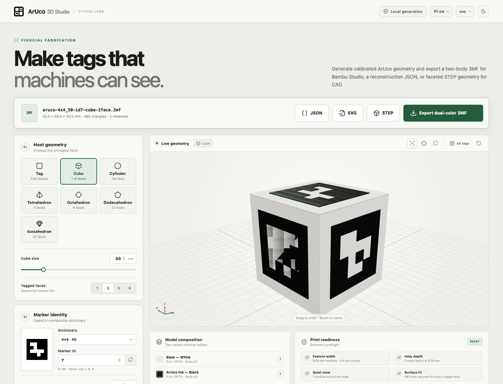

# 3D Printable ArUco

Browser-local generator for OpenCV-compatible ArUco tags, tagged primitives, and all five Platonic solids. It produces dual-color, raised-relief geometry for Bambu Studio bucket painting, plus 3MF, STEP, SVG, and reconstruction JSON exports.



## Features

- Flat tag grids from a pasted list of marker IDs
- Cubes (1, 3, 5, or 6 tagged faces), cylinders, tetrahedra, octahedra, dodecahedra, and icosahedra
- Raised black marker relief for easy material selection in slicers
- Dual-material 3MF, advanced B-rep STEP, SVG reference, and spatial reconstruction JSON
- English, Spanish, and Brazilian Portuguese interface options; millimeters or inches in the UI
- Runs entirely locally in the browser or from the terminal

## Run locally

```bash
npm install
npm run dev
```

## Generate from the terminal

Generate every output from a JSON configuration:

```bash
npm run generate -- --config examples/cube-5face.json --out ./generated
```

Limit outputs when needed:

```bash
npm run generate -- --config examples/cube-5face.json --out ./generated --formats 3mf,step,json,svg
```

The CLI uses millimeters and the same `GeneratorConfig` as the web app. Without `--config`, it uses the default cube configuration.

## Printing workflow

1. Export the dual-color 3MF.
2. Open it in Bambu Studio.
3. Use the bucket tool to assign `Base — White` and `ArUco Ink — Black` to filament slots.
4. Review the slice preview before printing.

The black code modules are raised for clear selection. A hidden connection below the white surface keeps each face’s black modules as one paintable material island.

## CAD and reconstruction

The STEP exporter writes advanced planar B-rep geometry in millimeters with explicit topology for CAD import. The structure JSON contains tag IDs, marker matrices, physical size, tag corners, face poses, and object/marker transforms for spatial reconstruction.

## Verify

```bash
npm run check
```

---

# Português (Brasil)

Gerador local de tags ArUco compatíveis com OpenCV, primitivas com tags e os cinco sólidos platônicos. Produz geometria bicolor em relevo, prática para pintar no Bambu Studio, além de exportações 3MF, STEP, SVG e JSON de reconstrução.


## Recursos

- Grades de tags planas a partir de uma lista de IDs
- Cubos (1, 3, 5 ou 6 faces com tags), cilindros, tetraedros, octaedros, dodecaedros e icosaedros
- Relevo preto para seleção simples de material no fatiador
- 3MF com dois materiais, STEP B-rep, SVG de referência e JSON espacial
- Interface em inglês, espanhol e português brasileiro; medidas em milímetros ou polegadas
- Execução local pelo navegador ou terminal

## Executar localmente

```bash
npm install
npm run dev
```

## Gerar pelo terminal

```bash
npm run generate -- --config examples/cube-5face.json --out ./generated
```

Para escolher os formatos:

```bash
npm run generate -- --config examples/cube-5face.json --out ./generated --formats 3mf,step,json,svg
```

O CLI usa milímetros e a mesma configuração (`GeneratorConfig`) do aplicativo web. Sem `--config`, usa a configuração padrão do cubo.

## Fluxo de impressão

1. Exporte o 3MF bicolor.
2. Abra no Bambu Studio.
3. Use a ferramenta de balde para atribuir `Base — White` e `ArUco Ink — Black` aos filamentos.
4. Revise a prévia do fatiamento antes de imprimir.

## Verificação

```bash
npm run check
```
